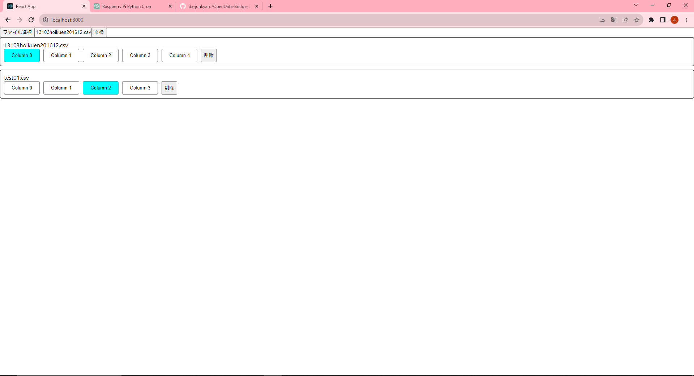

# setup
初めて実行するときのみ実行してください
```bash
npm install
```

# start
起動方法
```bash
npm start
```

# 起動中の画面サンプル
ファイルを選択すると、下にファイル名とカラム名（今はダミー）のまとまりができます  
統合後のカラム名で欲しいカラム名をクリックしてください  
一度クリックすると背景色が変わり選択状態になります  
この状態で変換ボタンを押すと、1つに統合されたcsvがダウンロードされる予定


